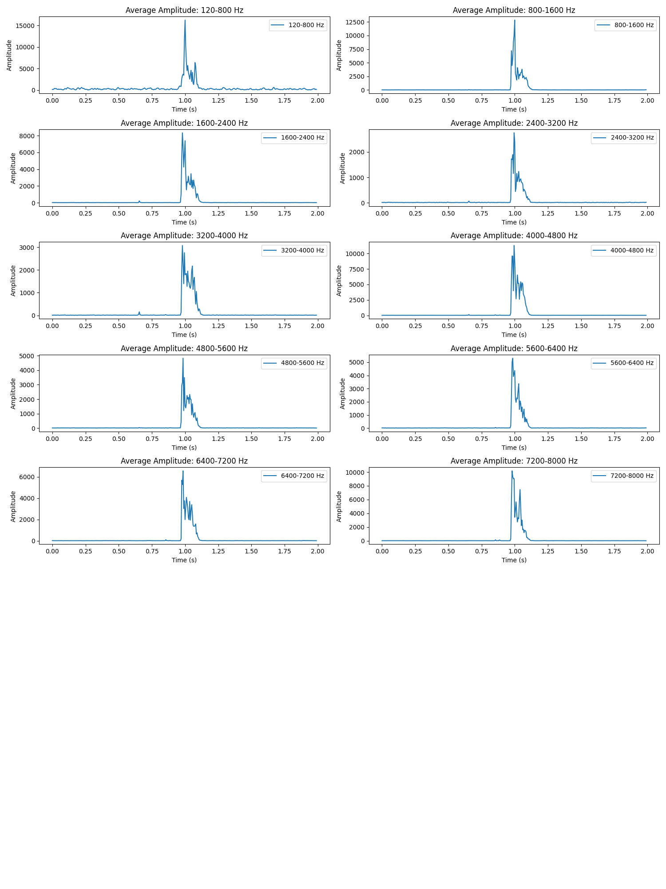

# BME 602 - Homework 5
Joseph Ho, Karina Buttram

## Answers
**A.** The speech recordings are [here](/recordings), which consist of a reading of the alphabet, and the sounds /f/ and /k/ for comparison.

**B.** The code for the speech analysis is [here](/speech_analysis.py).

**C.** In the code for the speech analysis, there are 10 speech features that are extracted from the speech recordings. These features include average amplitude of a frequency range determined by 10 fifth-order Butter bandpass filters from 0 to 8000 Hz. Every 5 ms, the fast fourier transform (fft) function is performed on the speech signal, and the average amplitude of the frequency range is calculated.

Shown below are the spectrogram, average amplitude of individual frequencies, and average amplitude of combined frequencies for the alphabet.

**D.** /f/ and /k/ sounds have major differences in their frequencies and amplitudes.

For the /f/ sound, the highest average amplitudes occur in the range of 7200-8000 Hz, 6400-7200 Hz and 5600-6400 Hz. In these signals, the peak of the average amplitude in the middle of the /f/ sound. Comparatively, the /k/ sound has the highest average amplitudes in the range of 120-800 Hz, 800-1600 Hz, andn 4000-4800 Hz. The peak of the average amplitude occurs near the beginning of the /k/ sound. 

Spectrogram, average amplitude of individual frequencies, and average amplitude of combined frequencies for the /f/ sound.

Spectrogram, average amplitude of individual frequencies, and average amplitude of combined frequencies for the /k/ sound.

**E.**

