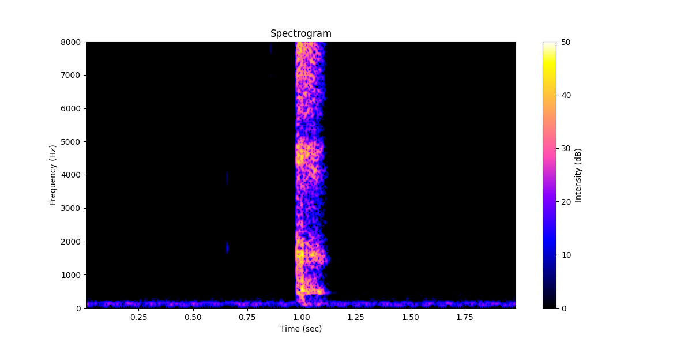

# BME 602 - Homework 5
Joseph Ho, Karina Buttram

## Answers
A. The speech recordings are [here](/recordings), which consist of a reading of the alphabet, and the sounds /f/ and /k/ for comparison.

B. The code for the speech recognition is [here](/speech_processing.py).

C. 

D. /f/ and /k/ sounds have differences in their frequency content. 

Here is the spectrogram for the /f/ sound:

Here is the spectrogram for the /k/ sound:

E.