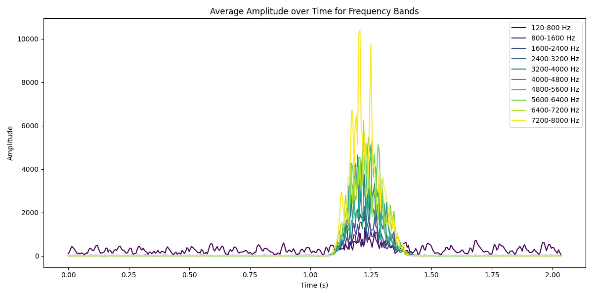

# BME 602 - Homework 5
Joseph Ho, Karina Buttram

## Answers
**A.** The speech recordings are [here](/recordings), which consist of a reading of the alphabet, and the sounds /f/ and /k/ for comparison.

**B.** The code for the speech analysis is [here](/speech_analysis.py).

**C.** In the code for the speech analysis, there are 10 speech features that are extracted from the speech recordings. These features include average amplitude of a frequency range determined by 10 pass band filters from 0 to 8000 Hz. Every 5 ms, the fast fourier transform (fft) function is performed on the speech signal, and the average amplitude of the frequency range is calculated.

**D.** /f/ and /k/ sounds have major differences in their frequencies and amplitudes.

For the /f/ sound:

For the /k/ sound:

**E.**